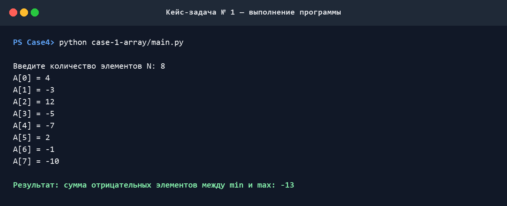

# Кейс-задача № 1 — массив

## Техническое задание

Дан одномерный массив `A` размерности `N`. Необходимо найти сумму отрицательных элементов, расположенных между максимальным и минимальным элементами массива. Максимальный и минимальный элементы в сумму не включаются.

Ответом на задачу является ссылка на репозиторий GitHub, в котором хранится программа, либо результат, переданный другим удобным способом.

## Решение

Для решения задачи я написала программу, которая:

1. считывает количество элементов `N`;
2. последовательно считывает элементы массива;
3. находит индексы первого минимального и первого максимального элементов;
4. определяет границы участка между ними независимо от порядка расположения;
5. суммирует только отрицательные элементы внутри этого участка.

Если минимальное или максимальное значение встречается несколько раз, я беру индекс его первого вхождения. Пустой массив не обрабатываю, поэтому при вводе проверяю, что `N` больше нуля.

## Выводы

- Я не сортирую массив, поэтому исходный порядок элементов и их позиции сохраняются.
- Порядок минимума и максимума не важен: я сравниваю их индексы и получаю левую и правую границы участка.
- Сам минимум и максимум в сумму не входят — они только задают границы.
- Положительные числа и нули я пропускаю. Если между границами нет отрицательных чисел, программа выводит `0`.
- Для поиска значений и их позиций я использовала `min()`, `max()` и `index()`. При повторении минимума или максимума `index()` берёт первое вхождение, и это влияет на выбранный участок.
- Вложенных циклов здесь нет, поэтому время работы растёт линейно — `O(N)`. Для хранения массива требуется `O(N)` памяти.
- Я отдельно проверяю `N > 0`, потому что `min()` и `max()` нельзя вызвать для пустого массива.

## Как воспроизвести результат

Я запускала программу на Python 3. Чтобы воспроизвести результат, из корня репозитория можно выполнить:

```bash
python case-1-array/main.py
```

Для проверки я ввела `N = 8` и массив `[4, -3, 12, -5, -7, 2, -1, -10]`. Между максимальным элементом `12` и минимальным элементом `-10` находятся числа `-5`, `-7` и `-1`, поэтому программа вывела `-13`.

## Демонстрация работы


