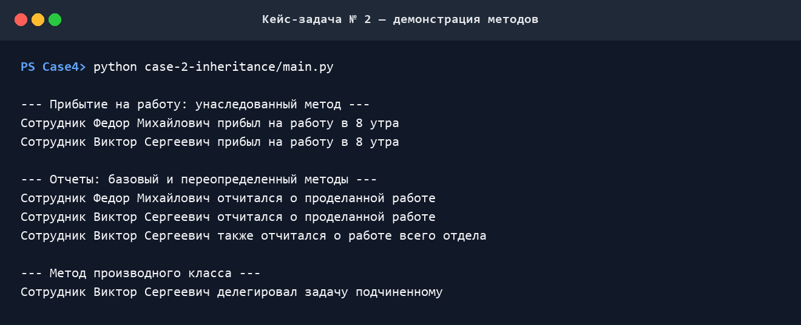

# Кейс-задача № 2 — наследование классов

## Техническое задание

Написать тестовую программу, которая демонстрирует работу методов базового и производного классов.

Ответом на задачу является ссылка на репозиторий GitHub, в котором хранится программа, либо результат, переданный другим удобным способом.

## Решение

Я сделал два класса:

- `Employee` — базовый класс сотрудника с методами `arrive_at_work()` и `report()`;
- `Chief` — производный класс руководителя, который наследует метод `arrive_at_work()`, переопределяет `report()` и добавляет собственный метод `delegate_task()`.

В `Chief.report()` я использовал `super().report()`: сначала выполняется метод базового класса, затем руководитель сообщает о работе всего отдела. В тестовой части я создаю по одному объекту каждого класса и показываю обычный, унаследованный, переопределённый и собственный методы.

## Выводы

- Я убедился, что `Chief` получает открытые поля и методы `Employee`: вызов `chief.arrive_at_work()` работает, хотя в самом `Chief` такого метода нет.
- Собственного конструктора у `Chief` нет, поэтому для него используется `Employee.__init__()`. Благодаря этому поле `name` есть у обоих объектов.
- В обратную сторону наследование не работает. Обычный `Employee` не получает `delegate_task()` из дочернего класса, поэтому `employee.delegate_task()` вызвал бы `AttributeError`.
- Я переопределил `report()` в `Chief`, и один вызов ведёт себя по-разному для сотрудника и руководителя. Так в программе проявляется полиморфизм.
- Через `super().report()` я повторно использую готовое поведение родительского класса, а не копирую его код.
- Метод `delegate_task()` показывает, что дочерний класс может не только менять унаследованные методы, но и добавлять свои возможности.
- В итоге общую логику сотрудников я оставил в `Employee`, а особенности руководителя вынес в `Chief`. Это уменьшает повторение кода и упрощает дальнейшее расширение программы.

## Как воспроизвести результат

Я запускал программу на Python 3. Чтобы увидеть тот же результат, из корня репозитория можно выполнить:

```bash
python case-2-inheritance/main.py
```

## Демонстрация работы


