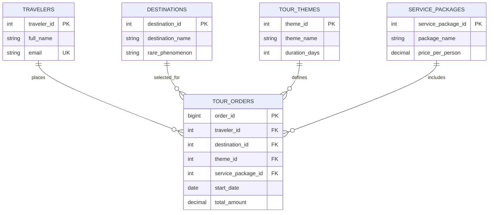

# Схема базы данных

```mermaid
erDiagram
    TRAVELERS ||--o{ TOUR_ORDERS : places
    DESTINATIONS ||--o{ TOUR_ORDERS : selected_for
    TOUR_THEMES ||--o{ TOUR_ORDERS : defines
    SERVICE_PACKAGES ||--o{ TOUR_ORDERS : includes

    TRAVELERS {
      int traveler_id PK
      string full_name
      string email UK
    }
    DESTINATIONS {
      int destination_id PK
      string destination_name
      string rare_phenomenon
    }
    TOUR_THEMES {
      int theme_id PK
      string theme_name
      int duration_days
    }
    SERVICE_PACKAGES {
      int service_package_id PK
      string package_name
      decimal price_per_person
    }
    TOUR_ORDERS {
      bigint order_id PK
      int traveler_id FK
      int destination_id FK
      int theme_id FK
      int service_package_id FK
      date start_date
      decimal total_amount
    }
```

Все внешние ключи я разместила в `tour_orders`. Благодаря этому один клиент, пункт назначения, формат тура или пакет услуг может быть связан с несколькими заказами.

