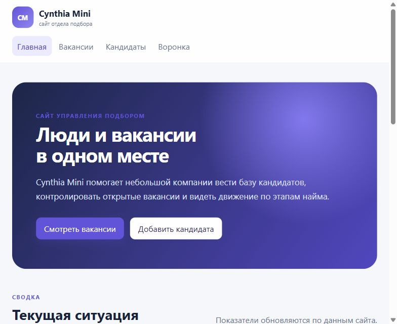
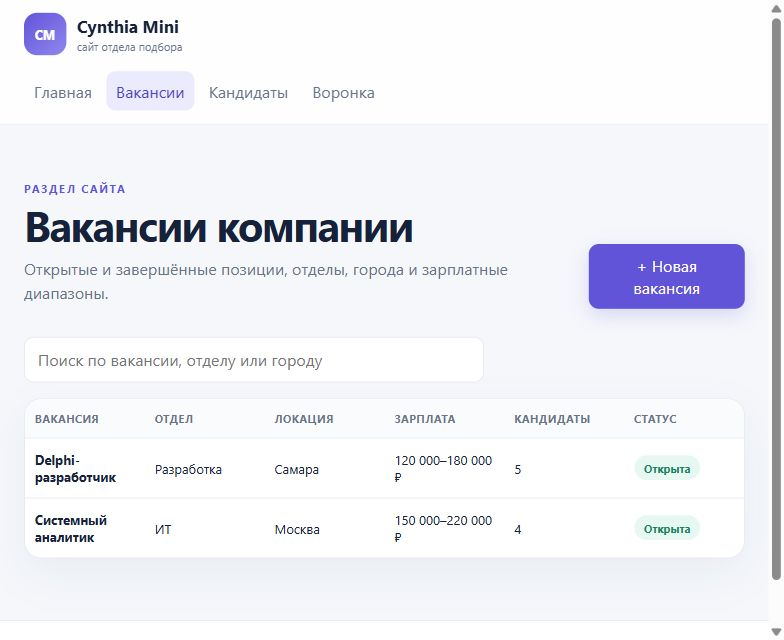
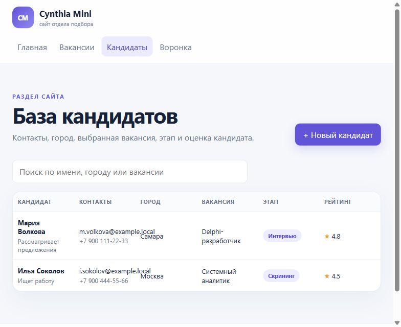
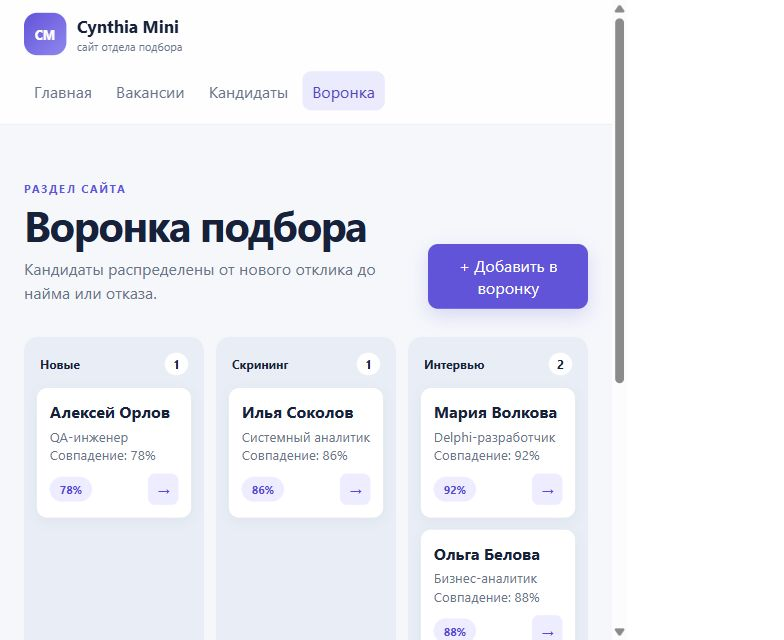
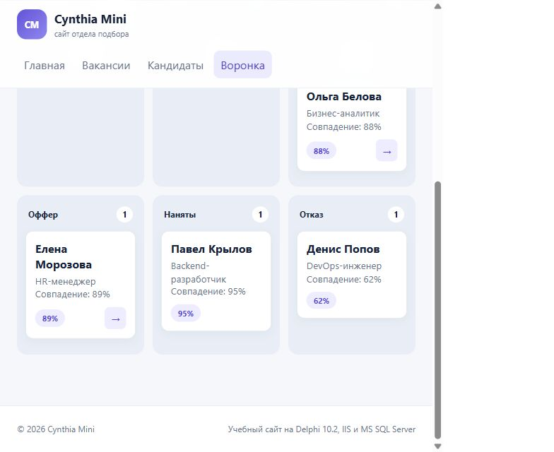

# Cynthia Mini

В этой работе я сделал небольшую учебную версию ATS-системы Cynthia. Интерфейс открывается в браузере, серверная часть работает на Delphi 10.2 WebBroker через IIS, а данные хранятся в Microsoft SQL Server.

## Что я реализовал

- адаптивная главная страница сайта с показателями;
- список и создание вакансий;
- список и создание кандидатов;
- привязка кандидата к вакансии;
- воронка подбора: новый → скрининг → интервью → оффер → нанят / отказ;
- сохранение истории смены этапов;
- JSON API и параметризованные SQL-запросы FireDAC;
- воспроизводимая схема MS SQL Server с ограничениями, связями, индексами и тестовыми данными.

Я сознательно не добавлял аутентификацию, загрузку резюме, отправку сообщений, AI-рейтинг и интеграции исходной Cynthia.

## Демонстрация работы

Для скриншотов я запустил интерфейс с тестовыми ответами API и оставил масштаб браузера 100%. На изображениях показаны основные сценарии работы.

### Главная страница



### Список вакансий



### База кандидатов



### Первые этапы воронки



### Заключительные этапы воронки



## Структура

```text
CynthiaMini/
├─ CynthiaMini.dpr                 # проект ISAPI-библиотеки
├─ src/WebModuleUnit.pas           # маршруты, REST API и работа с FireDAC
├─ src/WebModuleUnit.dfm
├─ www/index.html                  # одностраничный интерфейс
├─ www/styles.css
├─ www/responsive.css              # адаптивные стили для средних экранов
├─ www/app.js
├─ database/CynthiaMini.sql        # создание базы и тестовых данных
├─ database/smoke-test.sql         # запросы для быстрой проверки
├─ config.ini.example              # пример настроек подключения
└─ web.config                      # настройки обработчика IIS
```

## Что понадобится для воспроизведения

- Windows 10/11 или Windows Server с IIS;
- Delphi / RAD Studio 10.2 Tokyo;
- Microsoft SQL Server 2016+ и SQL Server Management Studio;
- Microsoft ODBC Driver for SQL Server или SQL Server Native Client, доступный FireDAC;
- включённая роль IIS `ISAPI Extensions`.

Я использовал одинаковую разрядность DLL, пула IIS и драйвера SQL Server. Если разрядность различается, приложение не загрузится.

## 1. Как воспроизвести базу данных

Я создавал базу через SQL Server Management Studio. Повторить это можно так:

1. Подключиться к SQL Server через SSMS под учётной записью с правом `CREATE DATABASE`.
2. Открыть `database/CynthiaMini.sql` и выполнить весь скрипт.
3. Выполнить `database/smoke-test.sql`. Для проверки я подготовил 8 вакансий, 15 кандидатов и 18 откликов на разных этапах.

Я сделал скрипт повторяемым: он не удаляет существующую базу и не добавляет тестовые записи второй раз, если в `Companies` уже есть данные.

## 2. Как воспроизвести сборку Delphi

Проект я собирал в Delphi 10.2. Последовательность действий:

1. Открыть `CynthiaMini.dpr` в Delphi 10.2.
2. Выбрать `Release` и платформу, которая совпадает с разрядностью пула IIS (у меня Win64).
3. Проверить, что FireDAC MSSQL включён в сборку.
4. Выполнить Build. После сборки получается `CynthiaMini.dll`.

Файл `.dpr` можно открыть напрямую. Если Delphi создаст рядом `.dproj`, он будет содержать локальные параметры проекта.

## 3. Как воспроизвести запуск в IIS

Чтобы запустить сайт так же, как у меня, можно выполнить следующие шаги:

1. Создать `C:\inetpub\CynthiaMini`.
2. Скопировать туда `CynthiaMini.dll`, папку `www`, `web.config` и `config.ini.example`.
3. Переименовать `config.ini.example` в `config.ini` и указать свои параметры подключения.
4. В Server Manager включить Web Server (IIS) → Application Development → ISAPI Extensions.
5. Создать отдельный пул приложений без Managed Runtime и выставить разрядность DLL.
6. Создать сайт или приложение с физическим путём `C:\inetpub\CynthiaMini`.
7. В `ISAPI and CGI Restrictions` разрешить полный путь к `CynthiaMini.dll`.
8. Сверить `scriptProcessor` в `web.config` с фактическим путём к DLL.
9. Дать учётной записи пула право читать папку и подключаться к базе при использовании Windows Authentication.
10. Открыть корень сайта. Я дополнительно проверял ответ `/api/dashboard` — это помогает понять, работает ли серверная часть.

Пример SQL-аутентификации:

```ini
[database]
Server=localhost\SQLEXPRESS
Database=CynthiaMini
OSAuthent=False
UserName=cynthia_app
Password=replace_me
```

`config.ini` я не добавлял в Git, потому что в нём могут находиться логин и пароль от базы. Файл уже указан в `.gitignore`.

## JSON API

| Метод | Маршрут | Назначение |
|---|---|---|
| GET | `/api/dashboard` | Сводные показатели |
| GET/POST | `/api/vacancies` | Список / создание вакансии |
| GET/POST | `/api/candidates` | Список / создание кандидата |
| GET/POST | `/api/applications` | Воронка / новый отклик |
| PUT | `/api/applications/{id}/stage` | Смена этапа подбора |

Пример:

```powershell
Invoke-RestMethod http://localhost/CynthiaMini/api/candidates -Method Post `
  -ContentType 'application/json' `
  -Body '{"firstName":"Павел","lastName":"Иванов","email":"p.ivanov@example.local","phone":"+7 900 000-00-00","city":"Самара"}'
```

## Мои выводы и дальнейшие доработки

В текущем виде я считаю проект учебным прототипом. Для реальной эксплуатации я бы добавил JWT- или Windows-аутентификацию, роли, CSRF/CORS-политику, полный журнал аудита, транзакции, внешнее хранение файлов, пагинацию, тесты API, защищённое хранение секретов и HTTPS.
