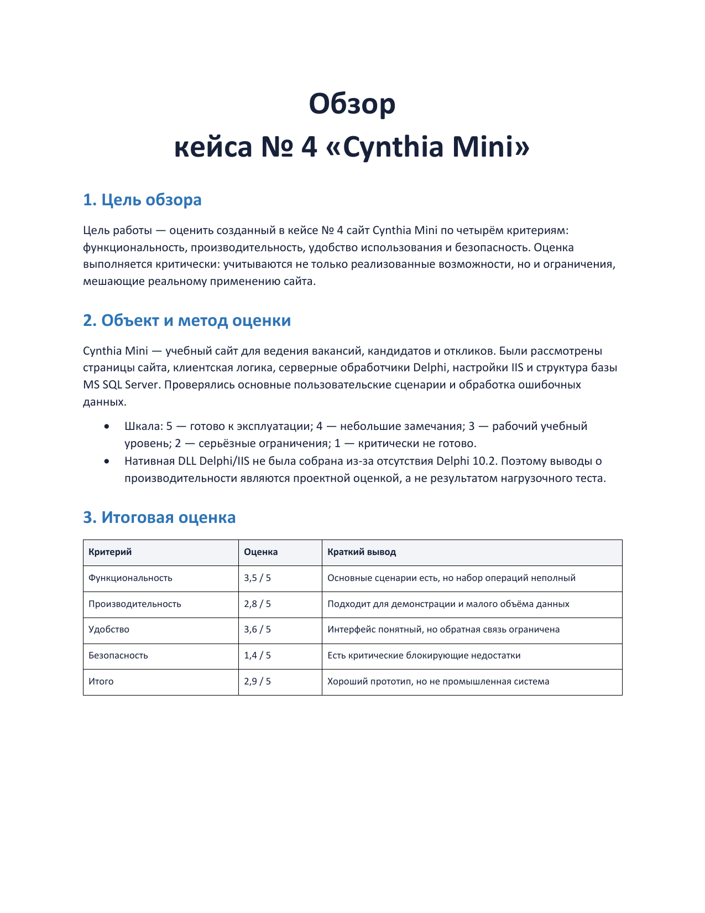

# Кейс-задача № 5 — обзор

## Описание

В каталоге находится обзор сайта Cynthia Mini, созданного в кейс-задаче № 4. Решение оценено по четырём критериям:

- функциональность;
- производительность;
- удобство использования;
- безопасность.

В отчёте приведены сильные стороны, обнаруженные ограничения, итоговые оценки и приоритетный план доработки. Общая оценка проекта — `2,9 из 5`: сайт подходит как учебный прототип, но перед использованием с реальными персональными данными требует аутентификации, разграничения ролей, HTTPS, безопасной обработки ошибок и более строгой серверной проверки данных.

Отчёт: [`Кейс-задача№5_Обзор_Cynthia_Mini.docx`](Кейс-задача№5_Обзор_Cynthia_Mini.docx).

## Демонстрация результата

